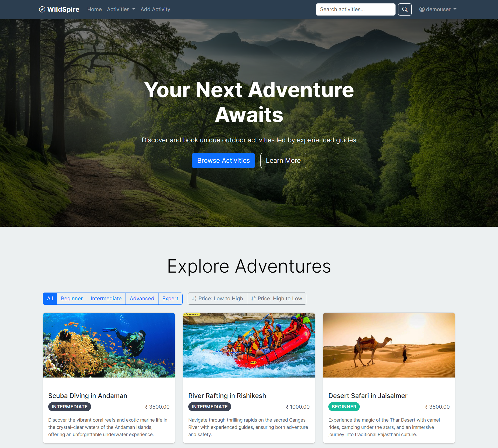
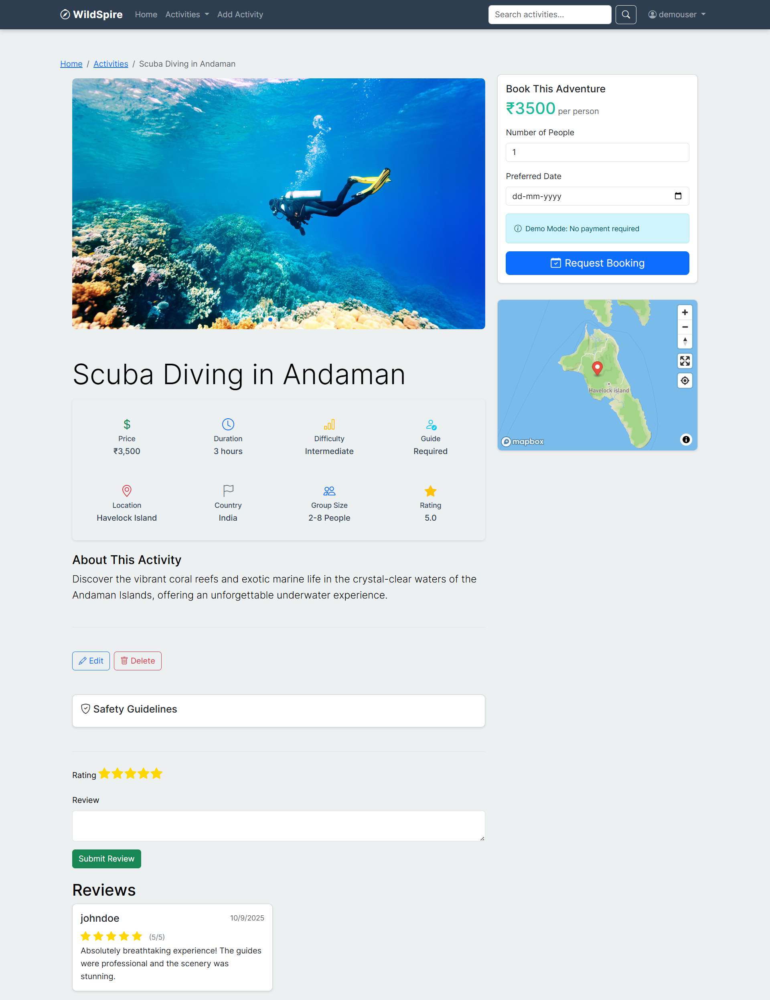
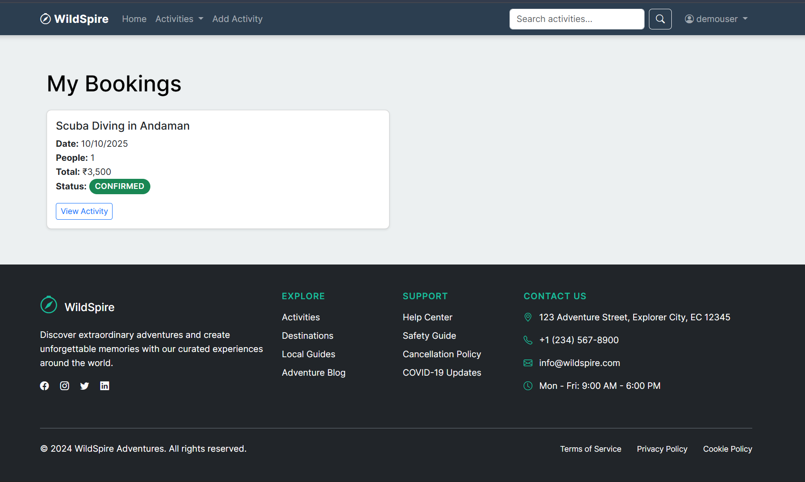

# WildSpire ⛰️

> A modern adventure activity booking platform built with **Node.js** and **MongoDB**


- **LinkedIn**: [Kasim Lohar](https://linkedin.com/in/kasimlohar)


---

## 🌟 Overview
WildSpire is a full-stack web application designed for discovering and booking adventure activities. Users can explore thrilling locations, leave reviews, and manage their bookings seamlessly. Whether you're into hiking, kayaking, or rock climbing, WildSpire helps you plan your next adventure effortlessly.

---

## ✨ Features
✅ **User Authentication** - Secure login/signup with Passport.js  
✅ **Activity Management** - Create, edit, and delete adventure activities  
✅ **Image Handling** - Upload multiple images with Cloudinary integration  
✅ **Location Services** - Interactive maps powered by Mapbox  
✅ **Review System** - User ratings and feedback for activities  
✅ **Responsive UI** - Mobile-first design with Bootstrap 5  
✅ **Enhanced Security** - Input validation, XSS protection, rate limiting  
✅ **Data Persistence** - MongoDB with Mongoose ODM  

---

## 🎥 Live Demo
🌐 **[View Live Demo](https://wildspire.vercel.app/)** - Try it now!

## 🔐 Demo Credentials
```
Email: demo@wildspire.com
Password: Demo@123
```
*Note: This is a demo account for testing purposes. All data may be reset periodically.*

---

## 🛠️ Tech Stack
- **Backend**: Node.js, Express.js
- **Database**: MongoDB, Mongoose
- **Frontend**: EJS, Bootstrap 5
- **APIs**: Mapbox, Cloudinary
- **Authentication**: Passport.js
- **Security**: Helmet, Express-Rate-Limit, MongoDB-Sanitize

---

## 📋 Prerequisites
Ensure you have the following installed before running the project:
- **[Node.js](https://nodejs.org/)** (>= 14.x)
- **[MongoDB](https://www.mongodb.com/)** (>= 4.x)
- **[Cloudinary](https://cloudinary.com/)** Account (for image uploads)
- **[Mapbox](https://www.mapbox.com/)** Account (for interactive maps)

---

## 🚀 Getting Started

### 1️⃣ Clone & Install Dependencies
```bash
# Clone the repository
git clone https://github.com/kasimlohar/wildspire.git
cd wildspire

# Install dependencies
npm install

# Start the development server
npm run dev
```

### 2️⃣ Setup Environment Variables
1. Copy `.env.example` to `.env`:
```bash
cp .env.example .env
```
2. Fill in your credentials:
```env
NODE_ENV=development
PORT=8080
MONGO_URI=your_mongodb_uri
CLOUD_NAME=your_cloudinary_name
CLOUD_API_KEY=your_cloudinary_key
CLOUD_API_SECRET=your_cloudinary_secret
MAP_TOKEN=your_mapbox_token
SESSION_SECRET=your_session_secret
```

---

## 📁 Project Structure
```
wildspire/
├── controllers/   # Route handlers
├── middleware/    # Custom middleware
├── models/        # Database schemas
├── public/        # Static assets
│   ├── css/
│   ├── js/
│   └── images/
├── routes/        # Route definitions
├── utils/         # Helper functions
└── views/         # EJS templates
```

---

## 🔒 Security Features
✅ **CSRF Protection** - Secure user interactions  
✅ **XSS Prevention** - Protects against cross-site scripting attacks  
✅ **Rate Limiting** - Prevents excessive API requests  
✅ **Input Validation** - Ensures data integrity  
✅ **Secure Sessions** - Protects user data  
✅ **Image Upload Validation** - Filters unsafe file types  

---

## 📸 Screenshots

### Homepage


### Activity Details


### Booking


### Profile


---

## 🧪 Testing

### Manual Testing Checklist
- [ ] User can register new account
- [ ] User can login/logout
- [ ] User can create activity with images
- [ ] User can edit own activities
- [ ] User can delete own activities
- [ ] User can add reviews
- [ ] User can edit own reviews
- [ ] User can delete own reviews
- [ ] User can book activities
- [ ] Search functionality works
- [ ] Filter by difficulty works
- [ ] Sort by price works
- [ ] Maps display correctly
- [ ] Image upload works
- [ ] Responsive on mobile
- [ ] Toast notifications appear
- [ ] Form validation works

### Running Tests
```bash
npm test
```

### Demo Verification
Run the demo verification script to test all functionality:
```bash
# Test all demo features
node test-demo.js

# Initialize database with demo data
npm run init-db
```

### Load Testing (Optional)
```bash
# Install artillery globally
npm install -g artillery

# Run load test
artillery quick --count 10 --num 50 https://your-app.vercel.com/activities
```

---

## 📱 Browser Support
- ✅ Chrome 90+
- ✅ Firefox 88+
- ✅ Safari 14+
- ✅ Edge 90+
- ⚠️ Internet Explorer - Not supported

---

## ⚡ Performance Optimizations
- **Image lazy loading** - Images load as user scrolls
- **Database indexing** - Text search and query optimization
- **Lean queries** - MongoDB `.lean()` for faster JSON conversion
- **CDN delivery** - Bootstrap, icons, and libraries from CDN
- **Gzip compression** - Automatic compression in production
- **CSS/JS minification** - Minified assets for production builds

---

## 🐛 Known Issues & Future Enhancements

### Known Issues
- Rate limiting may trigger during development due to hot reload (this is expected)
- Demo bookings are instant confirmations (no payment processing)

### Planned Features
- [ ] Email notifications for bookings and reviews
- [ ] Payment integration (Stripe/Razorpay)
- [ ] Admin dashboard for managing all activities
- [ ] Activity favoriting/wishlist
- [ ] Social media sharing integration
- [ ] Multi-language support (i18n)
- [ ] Mobile app (React Native)
- [ ] Advanced search with filters (date range, price range)
- [ ] Activity recommendations based on user preferences
- [ ] Real-time availability calendar

---

## 🚀 Deployment
WildSpire is ready for deployment on:
- **Render**  
- **Vercel**
- **Mongo Atlas**  
- **AWS**  

---

## 🤝 Contributing

Contributions are welcome! Please follow these steps:

1. **Fork the repository**
2. **Create feature branch**
   ```bash
   git checkout -b feature/AmazingFeature
   ```
3. **Commit your changes**
   ```bash
   git commit -m 'Add some AmazingFeature'
   ```
4. **Push to the branch**
   ```bash
   git push origin feature/AmazingFeature
   ```
5. **Open a Pull Request**

### Code Style Guidelines
- Use ES6+ features (arrow functions, async/await, destructuring)
- Follow ESLint configuration included in project
- Write meaningful commit messages using conventional commits
- Add comments for complex logic
- Update documentation for new features
- Test your changes before submitting PR

### Development Setup for Contributors
```bash
# Fork and clone the repo
git clone https://github.com/kasimlohar/wildspire.git
cd wildspire

# Install dependencies
npm install

# Set up environment variables
cp .env.example .env
# Edit .env with your credentials

# Initialize database with demo data
npm run init-db

# Start development server
npm run dev
```

---

## 🐛 Bug Reports
If you find any bugs, please open an issue with:
- **Bug description**
- **Steps to reproduce**
- **Expected vs actual behavior**

---

## � Support

For issues, questions, or suggestions:
- **Email**: kasimlohar@example.com
- **GitHub Issues**: [Create Issue](https://github.com/kasimlohar/wildspire/issues)
- **LinkedIn**: [Kasim Lohar](https://linkedin.com/in/kasimlohar)
- **Github**: [kasimlohar](https://github.com/kasimlohar)

---

## 📜 License

This project is licensed under the MIT License - see the [LICENSE](LICENSE) file for details.

### MIT License Summary
- ✅ Commercial use
- ✅ Modification
- ✅ Distribution
- ✅ Private use
- ⚠️ Liability and warranty limitations apply

---

## 🙏 Acknowledgments

Special thanks to:
- **[Mapbox](https://www.mapbox.com/)** - Beautiful mapping services and geocoding
- **[Cloudinary](https://cloudinary.com/)** - Reliable image hosting and transformation
- **[Bootstrap](https://getbootstrap.com/)** - Responsive UI components
- **[MongoDB](https://www.mongodb.com/)** - Flexible NoSQL database
- **[Express.js](https://expressjs.com/)** - Fast, minimalist web framework
- **[Passport.js](http://www.passportjs.org/)** - Authentication middleware
- **[EJS](https://ejs.co/)** - Embedded JavaScript templating
- **Unsplash Photographers** - Amazing activity images

### Resources Used
- [MDN Web Docs](https://developer.mozilla.org/) - JavaScript and Web API references
- [Stack Overflow](https://stackoverflow.com/) - Community support
- [Express.js Documentation](https://expressjs.com/) - Framework guide

---

**Made with ❤️ by Kasim Lohar**

⭐ **Star this repo if you found it helpful!**

🔗 **Share with others who might benefit from this project**

---

### Project Stats


Happy adventuring! 🏕️🌍

